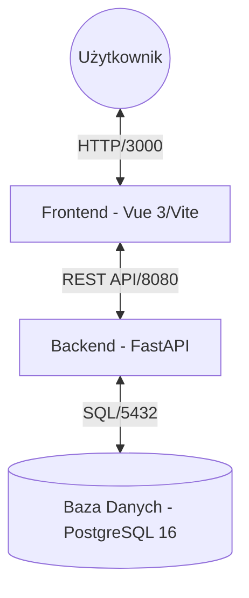

# 📐 Architektura Systemu (High-Level Design)

Ten dokument opisuje techniczne fundamenty projektu **FIZJO STORE**, wybrane technologie oraz sposób ich integracji.

---

## 🏗️ Ogólny Diagram Architektur (System Landscape)

System jest zaprojektowany jako zestaw luźno powiązanych usług kontenerowych:

---

## 🛠️ Stos Technologiczny

### Backend (FastAPI + SQLAlchemy)
- **FastAPI**: Nowoczesny, asynchroniczny framework zapewniający wysoką wydajność.
- **SQLAlchemy 2.0 (Async)**: Mapowanie obiektowo-relacyjne (ORM) obsługujące asynchroniczne połączenia do PostgreSQL.
- **Pydantic**: Walidacja danych i modelowanie schematów API.
- **Alembic**: Zarządzanie migracjami schematu bazy danych.

### Frontend (Vue.js + Pinia)
- **Vue 3 (Composition API)**: Framework UI bazujący na komponentach.
- **Pinia**: Magazyn stanu (State Management) dla koszyka zakupowego i sesji użytkownika.
- **Vite**: Ultra-szybkie środowisko budowania aplikacji (Build tool).
- **Vanilla CSS**: Lekkie, niestandardowe style bez zależności od dużych bibliotek CSS.

### Infrastruktura (Docker)
- **Docker Compose**: Zarządza uruchamianiem wszystkich procesów w izolowanych kontenerach.
- **Docker Networks**: Bezpieczna, wewnętrzna sieć łącząca Backend i Bazę Danych bez wystawiania wrażliwych portów na świat.

---

## 💾 Model Danych

Projekt bazuje na relacyjnym modelu danych zintegrowanym w **PostgreSQL**:

1. **User**: Dane użytkowników, role (Admin/Customer), zaszyfrowane hasła.
2. **Category**: Grupowanie produktów (np. "Ortezy", "Taśmy").
3. **Product**: Szczegóły produktów, ceny, stany magazynowe.
4. **Order**: Nagłówki zamówień, statusy i kwoty.
5. **OrderItem**: Pozycje zamówienia (produkty i ilości).

---

## 📡 Integracja API (Proxy)

Aplikacja kliencka (Frontend) komunikuje się z API poprzez **Vite Proxy Configuration**.
- Lokalnie (w kontenerze): `http://localhost:3000/api` przesyła zapytania do `http://backend:8080/api`.
- Pozwala to na uniknięcie problemów z CORS (Cross-Origin Resource Sharing) podczas fazy deweloperskiej.

---

## 🔐 Bezpieczeństwo
- **Autoryzacja**: JWT (JSON Web Tokens) do zabezpieczania endpointów.
- **Haszowanie**: Passlib z obsługą algorytmu bcrypt do bezpiecznego przechowywania haseł użytkowników.

---

## 🛡️ DevOps i CI/CD
*Projekt jest przygotowany do konteneryzacji, co ułatwia wdrożenie na dowolnym serwerze chmurowym (np. AWS, Google Cloud) przy użyciu standardowych narzędzi CI/CD (GitHub Actions).*
